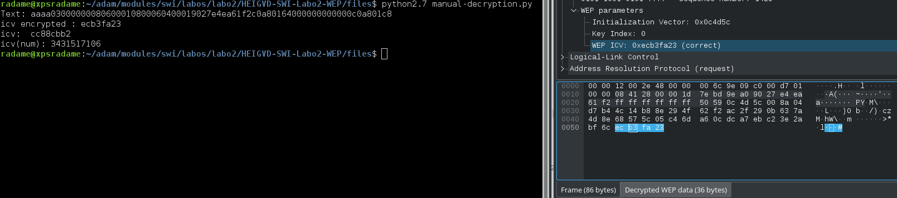
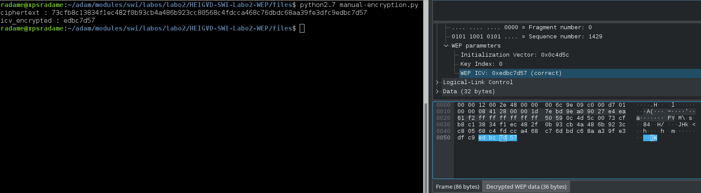
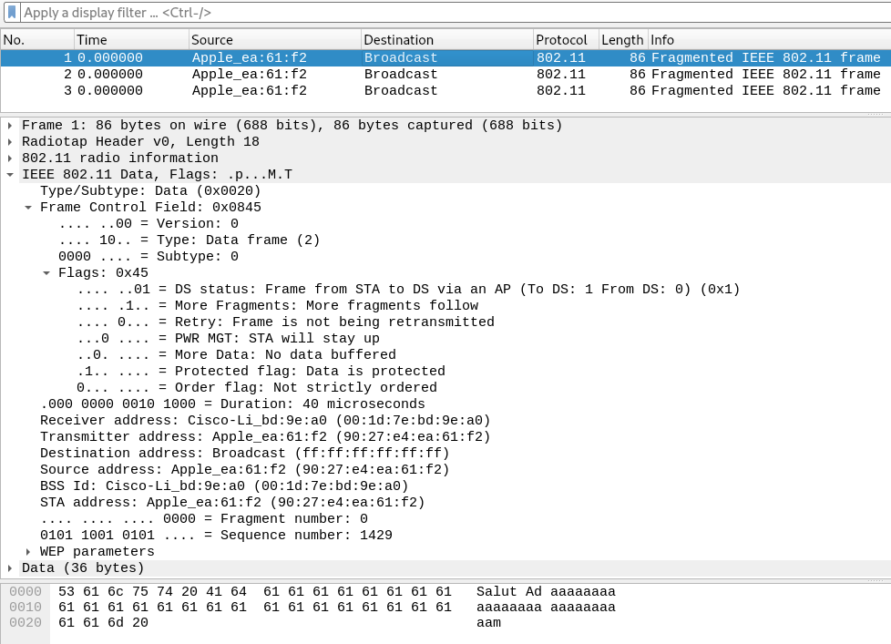
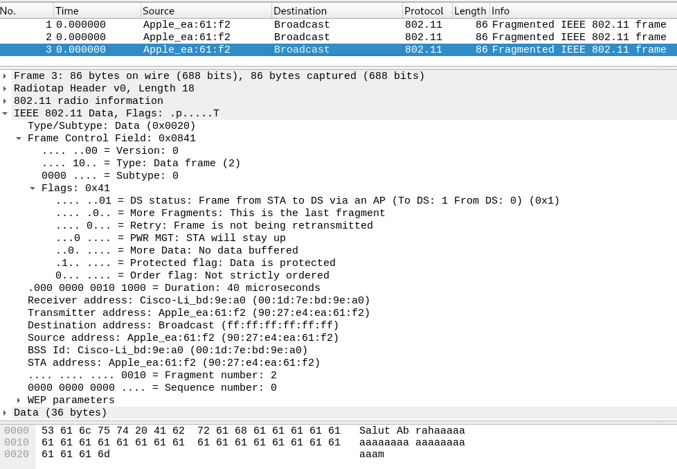
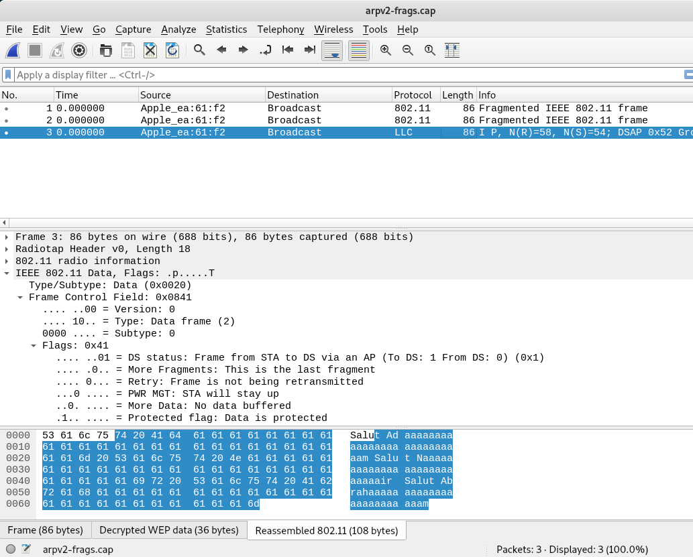

# Sécurité des réseaux sans fil

## Laboratoire 802.11 Sécurité WEP

__Auteurs : Nair Alic et Zouari Adam__

### 1. Déchiffrement manuel de WEP

- Comparer la sortie du script avec la capture text déchiffrée par Wireshark

Nous voyons que le texte déchiffré est le même dans la sortie du script que dans la capture Wireshark.
Pour ce qui est du WEP ICV, Wireshark le verifie (`correct`) mais l'affiche sous la forme chiffrée.
Nous avons verifié cela en ajoutant l'affichage de l'icv chiffré dans le script (`print("icv encrypted : " + '{:x}'.format(arp.icv))`) qui nous affiche bien `ecb3fa23` qui est bien la même valeur que Wireshark affiche.  

   

### 2. Chiffrement manuel de WEP

Dans notre script `manual-encryption.py` nous avons généré `arpv2.cap` qui est une copie de la capture de base ou nous avons simplement modifié les champs `icv` et `wepdata`. Wireshark est capable de déchiffré notre trame nous savons donc que la trame est correcte. De plus, dela même manière que pour l'étape 1, nous avons comparé la sortie de notre script.

### 3. Fragmentation

Dans cette partie, vous allez enrichir votre script développé dans la partie précédente pour chiffrer 3 fragments.

Notre script semble bien fonctionner bien et chiffre chaque fragments de la trame. On nous a demandé de chiffrer 3 fragments mais notre script fonctionne aussi pour n'importe quelle taille de message.

Dans cet exemple on a le premier fragment, on voit bien que le Flag "More fragment" annonce qu'il y a une suite : 

Et ici nous avons le dernier fragment et donc la fin de la trame : 

Et finalement la trame réassemblée, on voit bien que le message est complet :

### Quelques éléments à considérer :

- Chaque fragment est numéroté. La première trame d’une suite de fragments a toujours le numéro de fragment à 0. Une trame entière (sans fragmentation) comporte aussi le numéro de fragment égal à 0
- Pour incrémenter le compteur de fragments, vous pouvez utiliser le champ « SC » de la trame. Par exemple : `trame.SC += 1`
- Tous les fragments sauf le dernier ont le bit `more fragments` à 1, pour indiquer qu’un nouveau fragment va être reçu
- Le champ qui contient le bit « more fragments » est disponible en Scapy dans le champ `FCfield`. Il faudra donc manipuler ce champ pour vos fragments. Ce même champ est visible dans Wireshark dans IEEE 802.11 Data &rarr; Frame Control Field &rarr; Flags
- Pour vérifier que cette partie fonctionne, vous pouvez importer vos fragments dans Wireshark, qui doit être capable de les recomposer
- Pour un test encore plus intéressant (optionnel), vous pouvez utiliser un AP (disponible sur demande) et envoyer vos fragments. Pour que l’AP accepte vous données injectées, il faudra faire une « fake authentication » que vous pouvez faire avec `aireplay-ng`
- Si l’AP accepte vos fragments, il les recomposera et les retransmettra en une seule trame non-fragmentée !

### 4. Shared-key fake authentication (bonus)

**ATTENTION :  il y aura un bonus de 0.3 points dans le TE1 pour la première équipe qui rendra cet exercice terminé. Un bonus de 0.1 points pour les équipes suivantes**

Cet exercice nécessite l’utilisation d’un AP WEP configuré en mode d’authentification clé partagée (disponible sur demande).

Le but c’est de réussir une authentification auprès de l’AP sans connaître la clé WEP. Vous devrez :

- Configurer l’AP en WEP avec une clé connue, configurer l’authentification clé partagée et capturer un processus d’authentification et l’enregistrer dans un fichier .cap (voir fichier exemple [`exercice_4.cap`](https://github.com/arubinst/HEIGVD-SWI-Labo2-WEP/blob/master/files/).
- Ensuite, vous devez développer un script capable d’utiliser votre capture pour réaliser une authentification **sans utiliser la clé WEP**.

### Quelques éléments à considérer :

- La plupart des problèmes proviennent souvent du formatage de l’ICV (endianness, format, etc.). C’est donc une voie à explorer si vous n’arrivez pas à communiquer correctement avec l’AP (voir les scripts de base, chercher sur Internet, etc.)
- Pour le challenge « authentification », vous devez « entamer une conversation » avec l’AP. Scapy fournit une commande capable d’envoyer un seul paquet, en attendre la réponse et continuer l’exécution du script
- Attention à la taille du challenge et de la réponse chiffrée… !!!

## Livrables

Un fork du repo original . Puis, un Pull Request contenant :

-	Script de chiffrement WEP **abondamment commenté/documenté**
  - Fichier pcap généré par votre script contenant la trame chiffrée
  - Capture d’écran de votre trame importée et déchiffré par Wireshark
-	Script de fragmentation **abondamment commenté/documenté**
  - Fichier pcap généré par votre script contenant les fragments
  - Capture d’écran de vos trames importées et déchiffrés par Wireshark 
-	**(Challenge optionnel)** Script d’authentification clé partagée **abondamment commenté/documenté**
  - Capture d’écran de votre authentification vue par Wireshark

-	Envoyer le hash du commit et votre username GitHub par email au professeur et à l'assistant

## Échéance

Le 07 avril 2019 à 23h00
